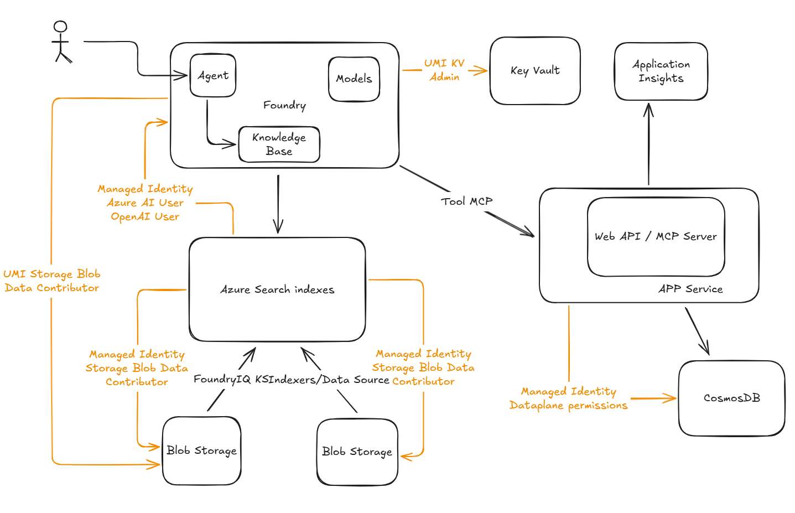

# Foundry IQ + Cosmos DB: RAG Pattern Implementation

> **⚠️ Important:** This repository is designed as a **demo and learning environment** to showcase RAG implementation patterns on Azure. It is **not intended for production use** without additional hardening, security reviews, and operational considerations. Use this as a foundation to understand capabilities and build upon for your specific requirements.

This repository demonstrates and compares two approaches for implementing **Retrieval-Augmented Generation (RAG)** on Azure, showcasing how **Microsoft Foundry IQ with Content Understanding** simplifies and accelerates enterprise RAG scenarios compared to manually orchestrating **Azure AI Search** components.

## 🎯 Repository Purpose

The goal is to provide a practical, hands-on comparison between:

1. **Microsoft Foundry IQ** — A comprehensive agent framework with built-in Content Understanding that abstracts index management, enrichment pipelines, and semantic retrieval.
2. **Classic Azure AI Search** — A manual approach requiring explicit configuration of indexes, indexers, data sources, and skillsets.

This repository includes fully automated **Infrastructure as Code (Terraform)** and **GitHub Actions workflows** to deploy a demo environment that illustrates both approaches on Azure. Use this as a starting point to explore, learn, and build your own production-grade solutions.

---

## 📦 Sample Data

To help you get started quickly, this repository provides **sample data** as a release attachment. The data is entirely **fictional** and designed to demonstrate RAG capabilities in a realistic enterprise scenario.

### What's Included

The sample data ZIP file contains information for **5 fictional technology companies**:

| Company | Description |
|---------|-------------|
| **FinovateX** | Fintech innovation platform |
| **FitBite** | Health and fitness technology |
| **LinguatechAI** | Language processing and translation AI |
| **NovaAgentics** | Multi-agent AI orchestration platform |
| **SentinelAI** | AI-powered security and threat detection |

### Data Types

#### 1. Documents for Indexing (Azure AI Search / Foundry Content Understanding)

The following document types are provided for each company:

- **Architecture Diagrams** — Visual representations of each company's Azure infrastructure
- **Architecture Review Transcripts** — Meeting notes and technical discussions from design reviews
- **Company Information** — Business profiles, technology stack details, and strategic objectives
- **Sales Policies** — Guidelines and best practices for selling Azure services to each company

These documents are designed to be ingested into:
- **Azure AI Search** (via indexers and skillsets)
- **Foundry Content Understanding** (for semantic retrieval and agent grounding)

#### 2. Structured Data for Cosmos DB

The ZIP file also includes **Azure spending data** for each company in JSON format, designed to be loaded into the Cosmos DB `customer_spent` container:

- Monthly Azure service consumption
- Cost breakdowns by service category

### How to Use the Sample Data

1. **Download the ZIP file** from the [Releases](../../releases) page
2. **Extract the contents** to a local directory
3. **For document indexing:**
   - Upload documents to the `customer-info` blob container in your Storage Account
   - Configure Azure AI Search indexers or Foundry Content Understanding to process the files
4. **For Cosmos DB:**
   - Use the Azure Cosmos DB Data Explorer or the MCP server API to insert spending records
   - Test queries like "Show me NovaAgentics' Azure spending trends" or "Which company spent the most on AI services?"

### Use Cases Demonstrated

With this sample data, you can demonstrate:

- **Semantic search** across company documentation
- **Grounded agent responses** using architecture review transcripts
- **Multi-source RAG** combining documents (AI Search/Foundry) with structured data (Cosmos DB)
- **Sales enablement scenarios** like "What are the best practices for selling Azure OpenAI to LinguatechAI?"
- **Financial analysis** using Cosmos DB queries combined with document context

---

## 🚀 Next Steps

After deploying the infrastructure and uploading sample data, follow these steps to complete the setup:

### 1. Configure Foundry Connections

The deployed Foundry resource is **not automatically connected** to other Azure resources. However, the associated **User Assigned Managed Identity** (`{projectName}-foundry-umi`) has already been granted the necessary permissions via the Bicep deployment.

**Action Required:**  
You must manually create connections in the **Azure AI Foundry management center** to enable Foundry to access:
- Azure AI Search (for semantic retrieval)
- Storage Account (for document access)
- Key Vault (for secrets management)

📖 **Step-by-step guide:** [Set up Key Vault connection in Azure AI Foundry](https://learn.microsoft.com/en-us/azure/ai-foundry/how-to/set-up-key-vault-connection?view=foundry-classic)

> **Tip:** When creating connections, select **"Use managed identity"** and choose the `{projectName}-foundry-umi` identity. This ensures connections use the pre-configured RBAC permissions.

### 2. Configure Azure AI Search (Classic Approach)

The sample data ZIP includes **JSON definition files** for manually configuring Azure AI Search resources:

- **Index definition** — Schema for searchable fields and vector embeddings
- **Data source definition** — Connection to the Storage Account blob container
- **Skillset definition** — Cognitive skills for text extraction, chunking, and embedding generation
- **Indexer definition** — Automation for ingestion and enrichment pipeline

**How to Use:**

1. Navigate to your **Azure AI Search** resource in the Azure Portal
2. Go to **Indexes** → **Add Index** → **JSON** and paste the index definition (replace placeholders like `{storageAccountName}`)
3. Repeat for **Data Sources**, **Skillsets**, and **Indexers**
4. Run the indexer to process documents from the `customer-info` blob container

> **Note:** Placeholders in the JSON files (e.g., `{projectName}`, `{storageAccountName}`) must be replaced with your actual resource names from the deployment.

---

## 🏗️ Architecture Overview

The solution consists of three core components working together to enable agent-driven RAG scenarios:

### 1. Model Context Protocol (MCP) Server for Cosmos DB

A **Web API** implementing the [Model Context Protocol (MCP)](https://modelcontextprotocol.io/) specification based on this [repo](https://github.com/AzureCosmosDB/MCPToolKit/), providing:
- Structured access to Azure Cosmos DB data for Microsoft Foundry agents
- Tool-based interface for retrieving recent documents and querying by ID
- Identity-based authentication using Azure Managed Identities
- Built-in observability via Application Insights

> **⚠️ Security Notice:** This demo implementation **does not include authentication or authorization** on the MCP API endpoints. All HTTP endpoints are publicly accessible without authentication. This approach is **intentionally simplified for learning and debugging purposes only**. In a production environment, you must implement proper authentication (e.g., Azure AD, API keys, managed identity validation) and authorization controls to secure your MCP server endpoints.

**Key Features:**
- Exposes Cosmos DB operations as MCP tools
- Consumed by Foundry as a **registered Tool**
- Enables agents to securely retrieve enterprise data stored in Cosmos DB
- Follows Azure best practices for service-to-service authentication

### 2. Azure Infrastructure (Terraform)

**Fully automated deployment** of all required Azure resources:

- **Azure Cosmos DB for NoSQL** — Document database storing customer data
- **Azure Web App (Linux, .NET 10)** — Hosts the MCP server API
- **App Service Plan** — Compute resources for the Web App
- **Azure AI Search** — Enterprise search service with vector capabilities
- **Storage Account** — Blob storage for content ingestion and indexing
- **Microsoft Foundry** — AI Services account with project for agent orchestration
- **Key Vault** — Secure storage for secrets and certificates
- **Log Analytics Workspace** — Centralized logging and diagnostics
- **Application Insights** — Application performance monitoring

### 3. Managed Identity Security Model

All inter-service communication uses **User Assigned Managed Identities (UAMI)** and **System Assigned Managed Identities (SAMI)**:

- **No secrets, keys, or connection strings** stored in code or configuration
- Role-based access control (RBAC) at every layer
- Azure-native identity federation for secure, zero-trust architecture




The diagram above illustrates the complete solution architecture, showing how the three core components work together to enable agent-driven RAG scenarios with dual approaches for content retrieval.

---

## 🔐 Security Architecture: Managed Identities Only

This solution implements **identity-based authentication** exclusively, following Azure security best practices:

### Managed Identities Created

| Identity | Type | Purpose |
|----------|------|---------|
| `{projectName}-ais-umi` | User Assigned | Used by Azure AI Search to access Storage and Foundry services |
| `{projectName}-foundry-umi` | User Assigned | Used by Foundry to access Key Vault |
| Web App Identity | System Assigned | Automatically created for the MCP API Web App |
| Foundry Project Identity | System Assigned | Automatically created for the Foundry project resource |

### Why Managed Identities?

- **Eliminates credential management**: No keys to rotate or secrets to leak
- **Least-privilege access**: Each service has only the permissions it needs
- **Audit trail**: All access is logged via Azure Activity Log and Azure Monitor
- **Compliance**: Meets enterprise security and governance requirements

---

## 🔑 Permissions and Role Assignments

The following role assignments are automatically configured via Bicep templates:

### Azure AI Search User Assigned Managed Identity

The `{projectName}-ais-umi` identity is granted the following roles to enable Azure AI Search to ingest, index, and enrich content:

| Role | Scope | Purpose |
|------|-------|---------|
| **Storage Blob Data Contributor** | Storage Account | Read and write access to blob containers for document ingestion |
| **Storage Table Data Contributor** | Storage Account | Track indexer progress and state using Azure Tables |
| **Azure AI User** | Foundry Resource | Query AI models for content enrichment (e.g., embeddings, summarization) |
| **Cognitive Services OpenAI User** | Foundry Resource | Access OpenAI models for vectorization and semantic understanding |
| **Cognitive Services User** | Foundry Resource | General access to AI Services capabilities |

**Why these permissions?**  
Azure AI Search requires read/write access to storage for document retrieval, table storage for state management, and AI Services access to execute cognitive skillsets (e.g., text embedding, entity extraction).

### Foundry User Assigned Managed Identity

The `{projectName}-foundry-umi` identity is granted:

| Role | Scope | Purpose |
|------|-------|---------|
| **Key Vault Contributor** | Key Vault | Manage vault configuration and policies |
| **Key Vault Secrets Officer** | Key Vault | Read and write secrets required for Foundry operations |

**Why these permissions?**  
Foundry agents may need to store and retrieve API keys, connection strings, or other sensitive configuration data securely.

### Web App System Assigned Managed Identity

The Web App hosting the MCP server requires **Cosmos DB data plane permissions** to query containers and retrieve documents.

**Configured via PowerShell script:**  
The [`Set-CosmosDB-Dataplane-Owner.ps1`](scripts/Set-CosmosDB-Dataplane-Owner.ps1) script assigns a **custom Cosmos DB role** with the following permissions:

```json
{
  "RoleName": "Azure Cosmos DB for NoSQL Data Plane Owner",
  "Type": "CustomRole",
  "DataActions": [
    "Microsoft.DocumentDB/databaseAccounts/readMetadata",
    "Microsoft.DocumentDB/databaseAccounts/sqlDatabases/containers/*",
    "Microsoft.DocumentDB/databaseAccounts/sqlDatabases/containers/items/*"
  ]
}
```

**Permissions Explained:**
- `readMetadata` — Read account-level information
- `containers/*` — Manage container lifecycle (create, read, update, delete)
- `items/*` — Full CRUD operations on items within containers

**Scope:** All databases and containers in the Cosmos DB account.

**Why a custom role?**  
Azure Cosmos DB supports RBAC via data plane roles. Since the built-in roles may be too permissive or restrictive, a custom role ensures **least-privilege access** tailored to the MCP server's needs.

---

## 📊 Foundry IQ vs Classic Azure AI Search

### Classic Azure AI Search Approach

When implementing RAG manually with Azure AI Search, developers must:

1. **Define an Index Schema**  
   - Map fields, data types, and analyzers
   - Configure vector fields for embeddings
   - Set up scoring profiles for ranking

2. **Create a Data Source**  
   - Connect to storage (Blob, Cosmos DB, SQL)
   - Configure change tracking for incremental updates
   - Manage connection strings or managed identities

3. **Build an Indexer**  
   - Schedule data ingestion
   - Handle errors and retries
   - Monitor indexing progress

4. **Design a Skillset (Optional)**  
   - Extract entities, key phrases, or OCR text
   - Generate vector embeddings via AI models
   - Chain multiple cognitive skills together

5. **Query and Retrieve**  
   - Write complex search queries (Lucene or OData syntax)
   - Integrate semantic ranking and vector search
   - Handle pagination, filtering, and faceting

**Operational Overhead:**
- Manual schema evolution and versioning
- Complex debugging when indexers or skillsets fail
- Tight coupling between data source, index, and application logic
- Requires deep Azure AI Search expertise

---

### Foundry IQ with Content Understanding

Foundry IQ **abstracts and automates** much of the manual work:

1. **Automatic Content Ingestion**  
   - Upload files or connect data sources
   - Foundry detects formats (PDF, Word, JSON, etc.) and extracts content

2. **Built-in Enrichment**  
   - Text chunking and embedding generation
   - Entity extraction and metadata tagging
   - No skillset configuration required

3. **Semantic Index Management**  
   - Foundry creates and manages indexes internally
   - Automatic schema inference based on content
   - Optimized for agent-driven retrieval

4. **Agent-Native Retrieval**  
   - Agents query content using natural language
   - Contextual search with grounding and citations
   - Seamless integration with chat completions

**Developer Experience Benefits:**
- **Faster time to value** — Deploy RAG in minutes, not days
- **Less code to maintain** — No indexer or skillset JSON files
- **Integrated agent framework** — Content Understanding + Agents + Tools in one platform
- **Iterative development** — Easily test and refine retrieval quality

**When to Use Each Approach:**

| Scenario | Recommended Approach |
|----------|----------------------|
| **Agent-based applications** requiring conversational RAG | Foundry IQ |
| **Rapid prototyping** of AI experiences | Foundry IQ |
| **Multi-modal content** (images, documents, structured data) | Foundry IQ |
| **Fine-grained control** over indexing pipelines | Classic Azure AI Search |
| **Custom scoring/ranking** algorithms | Classic Azure AI Search |
| **Integration with existing Azure Search workloads** | Classic Azure AI Search |

---

## 🚀 Deployment

### Prerequisites

1. **Azure Subscription** with permissions to create resources
2. **GitHub Repository** with the following secrets and variables configured
3. **Azure CLI** or **Portal access** for initial setup

### GitHub Secrets (Required)

| Secret Name | Description |
|-------------|-------------|
| `AZURE_CLIENT_ID` | Application (client) ID of the Entra ID App Registration |
| `AZURE_TENANT_ID` | Azure Active Directory tenant ID |
| `AZURE_SUBSCRIPTION_ID` | Target Azure subscription ID |

### GitHub Variables (Required)

| Variable Name | Example Value | Description |
|---------------|---------------|-------------|
| `PROJECT_NAME` | `fiqftcosmos` | Unique project identifier (lowercase, no spaces) |
| `AZURE_RESOURCE_GROUP` | `rg-foundryiq-ft-cosmos` | Resource group name |
| `AZURE_LOCATION` | `swedencentral` | Azure region for deployment |

> **Note:** `PROJECT_NAME` is used as a prefix for all resource names (e.g., `{PROJECT_NAME}-cdb` for Cosmos DB).

### Setup Instructions

Refer to [SETUP-DEPLOYMENT.md](SETUP-DEPLOYMENT.md) for detailed step-by-step instructions on:
- Creating an Entra ID App Registration
- Configuring federated credentials for GitHub Actions (OIDC)
- Assigning Azure RBAC permissions
- Running the automated deployment workflows

---

## 📂 Automated Workflows

### 1. Infrastructure Deployment

**Workflow:** [`.github/workflows/deploy-infra.yaml`](.github/workflows/deploy-infra.yaml)

**Triggers:**
- Push to `main` with changes in `infra/**`
- Manual trigger via `workflow_dispatch`

**What It Deploys:**
- Cosmos DB account with `customers` database and `customer_spent` container
- Storage account with `customer-info` blob container
- Azure Web App (Linux, .NET 10) for MCP server
- Azure AI Search with managed identity
- Microsoft Foundry resource with project
- Key Vault with RBAC enabled
- Log Analytics Workspace and Application Insights

**Outputs:**
- Cosmos DB endpoint
- Application Insights connection string
- Web App name

### 2. MCP API Deployment

**Workflow:** [`.github/workflows/deploy-mcp.yaml`](.github/workflows/deploy-mcp.yaml)

**Triggers:**
- Push to `main` with changes in `src/Customers.MCP/**`
- Manual trigger via `workflow_dispatch`

**What It Does:**
1. Builds the .NET 10 MCP server API
2. Publishes and packages the application
3. Deploys to Azure Web App via ZIP deploy
4. Automatically configures app settings:
   - `COSMOS_ENDPOINT` (from infrastructure output)
   - `APPLICATIONINSIGHTS_CONNECTION_STRING` (from infrastructure output)

---

## 🛠️ Post-Deployment Configuration

After deploying the infrastructure and MCP API, assign **Cosmos DB data plane permissions** to the Web App managed identity, Foundry user managed identity and yourself:

```bash
# Get the Web App's system assigned managed identity principal ID
PRINCIPAL_ID=$(az webapp identity show \
  --name {PROJECT_NAME}-mcpapi \
  --resource-group {RESOURCE_GROUP_NAME} \
  --query principalId -o tsv)

# Run the PowerShell script to grant Cosmos DB access
pwsh ./scripts/Set-CosmosDB-Dataplane-Owner.ps1 \
  $PRINCIPAL_ID \
  {RESOURCE_GROUP_NAME} \
  {PROJECT_NAME}-cdb
```

**What This Does:**
- Creates a custom Cosmos DB RBAC role (if it doesn't exist)
- Assigns the role to the Web App's managed identity
- Grants full data plane access to all databases and containers

---

## 🧪 Testing the MCP Server

### Health Check

```bash
curl https://{PROJECT_NAME}-mcpapi.azurewebsites.net/health
```

### MCP Protocol Initialization

```bash
curl -X POST https://{PROJECT_NAME}-mcpapi.azurewebsites.net/mcp \
  -H "Content-Type: application/json" \
  -d '{
    "jsonrpc": "2.0",
    "method": "initialize",
    "id": 1
  }'
```

**Expected Response:**

```json
{
  "jsonrpc": "2.0",
  "id": 1,
  "result": {
    "protocolVersion": "2024-11-05",
    "capabilities": {
      "tools": {}
    },
    "serverInfo": {
      "name": "azure-cosmosdb-mcp-toolkit",
      "version": "1.0.0"
    }
  }
}
```

### List Available Tools

```bash
curl -X POST https://{PROJECT_NAME}-mcpapi.azurewebsites.net/mcp \
  -H "Content-Type: application/json" \
  -d '{
    "jsonrpc": "2.0",
    "method": "tools/list",
    "id": 2
  }'
```

---

## 📖 MCP Server Tools

The MCP server exposes the following tools for Foundry agents to interact with Cosmos DB data:

### `get_recent_documents`

Retrieves the N most recent documents from a Cosmos DB container, ordered by timestamp (`_ts DESC`).

**Parameters:**
- `databaseId` (string, required) — Database ID
- `containerId` (string, required) — Container ID
- `n` (integer, required) — Number of documents to return (1-20)

**Example:**

```json
{
  "jsonrpc": "2.0",
  "method": "tools/call",
  "params": {
    "name": "get_recent_documents",
    "arguments": {
      "databaseId": "customers",
      "containerId": "customer_spent",
      "n": 5
    }
  },
  "id": 3
}
```

### `find_document_by_id`

Finds a document by its unique `id` field.

**Parameters:**
- `databaseId` (string, required) — Database ID
- `containerId` (string, required) — Container ID
- `id` (string, required) — Document ID

**Example:**

```json
{
  "jsonrpc": "2.0",
  "method": "tools/call",
  "params": {
    "name": "find_document_by_id",
    "arguments": {
      "databaseId": "customers",
      "containerId": "customer_spent",
      "id": "f9399883-e28c-4737-9249-c350849c67b1"
    }
  },
  "id": 4
}
```

### `get_customer_services`

Gets a list of all distinct Azure services used by a specific customer.

**Parameters:**
- `databaseId` (string, required) — Database ID
- `containerId` (string, required) — Container ID
- `customerName` (string, required) — Name of the customer (e.g., "FinovateX", "NovaAgentics")

**Example:**

```json
{
  "jsonrpc": "2.0",
  "method": "tools/call",
  "params": {
    "name": "get_customer_services",
    "arguments": {
      "databaseId": "customers",
      "containerId": "customer_spent",
      "customerName": "NovaAgentics"
    }
  },
  "id": 5
}
```

**Response:**

```json
{
  "customer_name": "NovaAgentics",
  "services": [
    {
      "service_name": "Azure Disk Storage",
      "service_family": "Storage"
    },
    {
      "service_name": "Azure OpenAI",
      "service_family": "AI + Machine Learning"
    }
  ],
  "count": 2
}
```

### `get_customer_service_spending`

Gets the total spending and transaction count for a specific customer on a specific Azure service.

**Parameters:**
- `databaseId` (string, required) — Database ID
- `containerId` (string, required) — Container ID
- `customerName` (string, required) — Name of the customer
- `serviceName` (string, required) — Name of the Azure service (e.g., "Azure Disk Storage", "Azure OpenAI")

**Example:**

```json
{
  "jsonrpc": "2.0",
  "method": "tools/call",
  "params": {
    "name": "get_customer_service_spending",
    "arguments": {
      "databaseId": "customers",
      "containerId": "customer_spent",
      "customerName": "FinovateX",
      "serviceName": "Azure Disk Storage"
    }
  },
  "id": 6
}
```

**Response:**

```json
{
  "total_spending": 15250.50,
  "transaction_count": 12,
  "customer_name": "FinovateX",
  "service_name": "Azure Disk Storage",
  "service_family": "Storage"
}
```


## 📚 Additional Resources

- [Model Context Protocol (MCP) Specification](https://modelcontextprotocol.io/)
- [Azure Cosmos DB Best Practices](https://learn.microsoft.com/azure/cosmos-db/nosql/best-practice-dotnet)
- [Azure AI Search Documentation](https://learn.microsoft.com/azure/search/)
- [Microsoft Foundry (Azure AI Foundry)](https://learn.microsoft.com/azure/ai-services/foundry/)
- [Azure Managed Identities](https://learn.microsoft.com/azure/active-directory/managed-identities-azure-resources/overview)

---

## 📝 License

This project is provided **as-is** for educational and demonstration purposes. It is not production-ready and should be used as a learning resource and foundation for building your own solutions.

## ⚠️ Production Considerations

Before using this architecture in production, consider:

- **Network Security:** Implement Private Endpoints, VNets, and NSGs
- **Data Encryption:** Enable encryption at rest with customer-managed keys
- **Backup & DR:** Configure geo-redundancy and backup policies
- **Monitoring & Alerts:** Set up comprehensive monitoring, alerting, and log retention
- **Cost Management:** Implement budgets, cost alerts, and resource tagging
- **Compliance:** Review data residency, audit logging, and regulatory requirements
- **High Availability:** Configure zone redundancy and multi-region deployments
- **Security Hardening:** Implement WAF, DDoS protection, and threat detection
- **Access Control:** Review and restrict permissions following least-privilege principles
- **Testing:** Implement comprehensive testing, including load, security, and chaos testing
